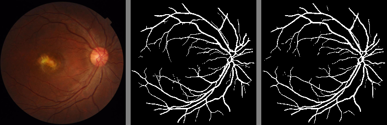
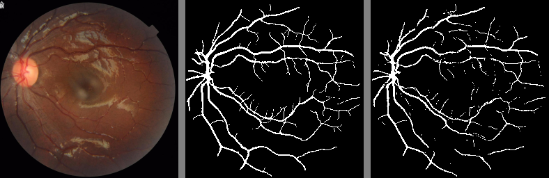

# Retinal Vessel Segmentation with UNet

This project implements a simple UNet architecture to segment blood vessels in retinal fundus images. We use [PyTorch Lightning](https://www.pytorchlightning.ai/) to streamline the training process and maintain well-structured, modular code.

## Sample Results

Below are a few samples showcasing the model's performance:

1. **First Image:** The original retinal fundus image.
2. **Second Image:** The ground truth segmentation mask.
3. **Third Image:** The predicted segmentation mask produced by the model.

Additionally, the following are combined samples showing the original image, ground truth, and predicted mask in one:

1. **Sample 1:** Original image, ground truth segmentation mask, and predicted mask in one triplet.  
   

2. **Sample 2:** Another example with the original image, ground truth mask, and predicted segmentation mask.  
   


## Model Performance

The model achieves the following performance metrics:

- **Jaccard Index (IoU):** 0.7354
- **F1 Score:** 0.8427
- **Recall:** 0.8359
- **Precision:** 0.8555
- **Accuracy:** 0.9798

## Training Process

Training was conducted on a high-performance computing cluster by submitting a SLURM job. This allowed efficient parallelization and utilization of computational resources.

For local training and evaluation, you can run:

```bash
python train.py  # Train the model
python test.py   # Evaluate the model
```

## Logger Integration with PyTorch Lightning

We use **Weights & Biases (WandB)** for logging and tracking the training and evaluation metrics in our PyTorch Lightning experiments. WandB provides a comprehensive suite for experiment tracking, model versioning, and visualizing training progress.


<h6 style="font-size: 7px; color: #999;">Acknowledgment: The UNet architecture used in this project is briefly inspired by the work of author https://github.com/nikhilroxtomar. </h6>  

